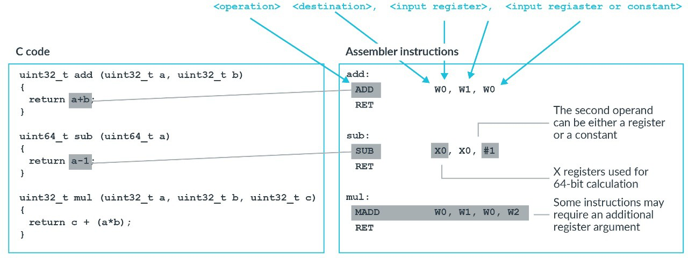

# ARM64 Cheat Sheet

## Registers

- 31 General Purpose Registers, 64bit, `X0 → X30` or `W0 → W30` when used in 32bit
- 32 Floating Point General Purpose Registers, 128bit, `Qx/Dx/Sx/Hx/Bx` stand for 128, 64, 32, 16, 8 bits. Where x in [0, 31]
- Stack Pointer, `SP` base address for load and store
- Link Register, `LR`, aka X30, used to store function return point
- Program Counter, `PC`, can be read using `ADR Xd, .`
- Zero Registers, `XZR` and `WZR`

> Note: In the A32 and T32 instruction sets, the PC and SP are general purpose registers.
This is not the case in A64 instruction set.

System Registers, `SCTLR_EL1`, `SCTLR_EL2`, `SCTLR_EL3` _ELx specifies the minimum privilege necessary to access the register

> Note: Sometimes you will see _EL12 or _EL01. These are used as part of virtualization.

## Instructions

| Name                                               | Description                                                  |
| -------------------------------------------------- | ------------------------------------------------------------ |
| ADD                                                |                                                              |
| FADD                                               |                                                              |
| MRS Xd, \<system register\>                        | reads the system register into Xd                            |
| MSR \<system register\>, Xn                        | write Xn to the system register                              |
| SXTx                                               | sign extend, the x determines the size of the data being extended |
| UXTx                                               | unsign extend, the x determines the size of the data being extended |
| SCVTF Dx, Xn                                       | convert integer to float                                     |
| FCTxx                                              | In this instance, different values of 'xx' control the rounding mode used |
| LDR\<Sign\>\<Size\> \<Destination\>, [\<address\>] | load                                                         |
| STR\<Size\> \<Destination\>, [\<address\>]         | store                                                        |
| SVC - Supervisor call                              | Causes an exception targeting EL1. Used by an application to call the OS. |
| HVC - Hypervisor call                              | Causes an exception targeting EL2. Used by an OS to call the hypervisor, not available at EL0. |
| SMC - Secure monitor call                          | Causes an exception targeting EL3. Used by an OS or hypervisor to call the EL3 firmware, not available at EL0. |

